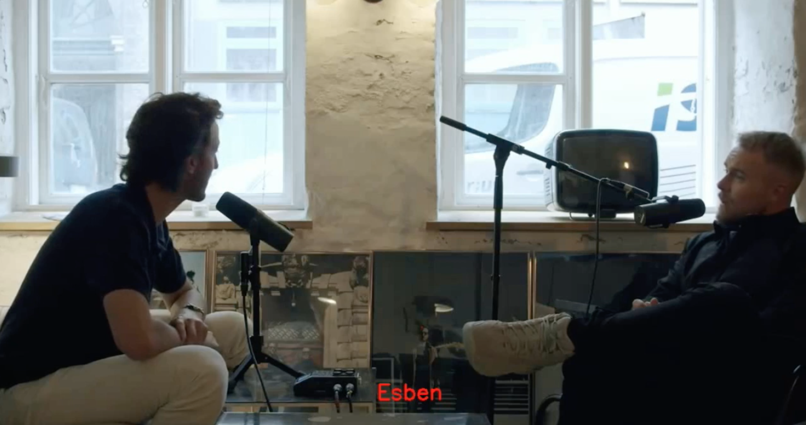
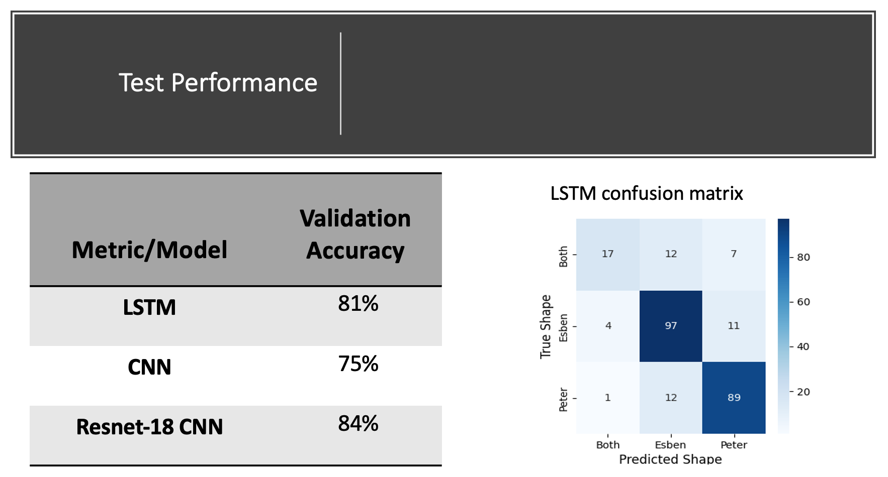
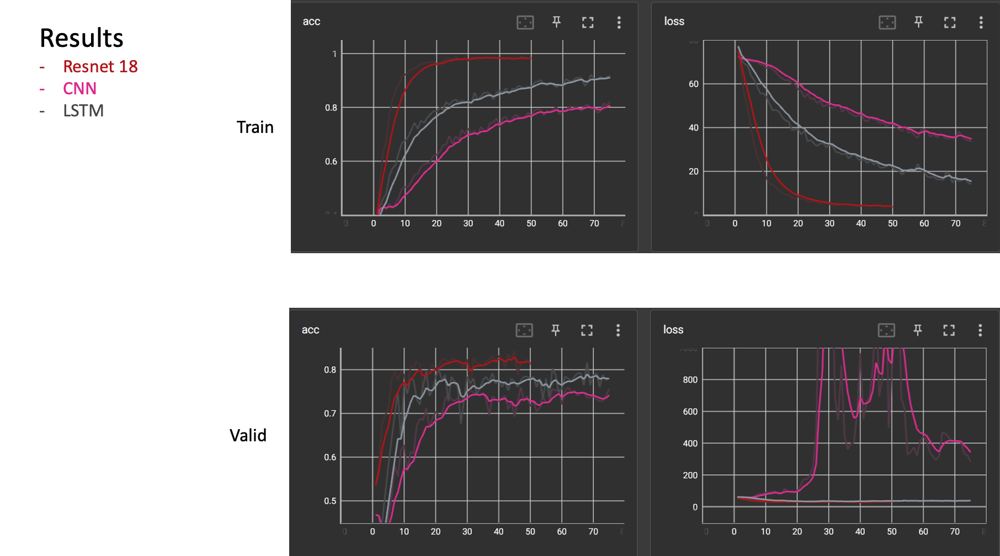

## Which Podcaster
This project contains three neural networks that can determine which host of the Danish podcast _Her Går Det Godt_ - Esbjen, Peter or both - from labeled 5 second clips.

## Motivation
This project was completed as part of the Deep Neural Networks class in the fall of 2021 at the University of Southern Denmark. 
 
## Screenshots

## Features
This project contains 3 different model architectures, each of which are able to learn to correctly label all of the given dataset.
We also developed a caption creating pipeline to test our models on external data, which writes which of the hosts is speaking on each frame of a video.

## How to use?
To train a model execute the **main.py** script where you can change some hyperparameters to adjust the performance. It is possible to split the 5 second clips into smaller files to test if the networks can perform classification at a higher rate. To this execute **data_splitter.py** where the chunk length can be adjusted as desired. To create subtitles an audio track must be imported and split using **data_splitter.py**, next the text file save must be uncommented in main.py under execute testto produce a text file containing the predictions. The captions can then be added by executing **Subtitlewritter.py** with the appropriate updated file paths for the predictions and the video. The audio must then be added back using a third party video editing software or by other means. 

## Our Results
We tested our models on 1 second data where we hand removed the shortened _Both_ files which no longer contained both hosts.

